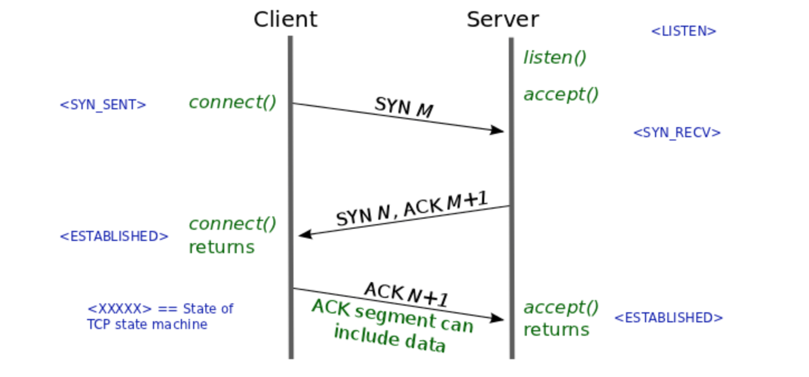
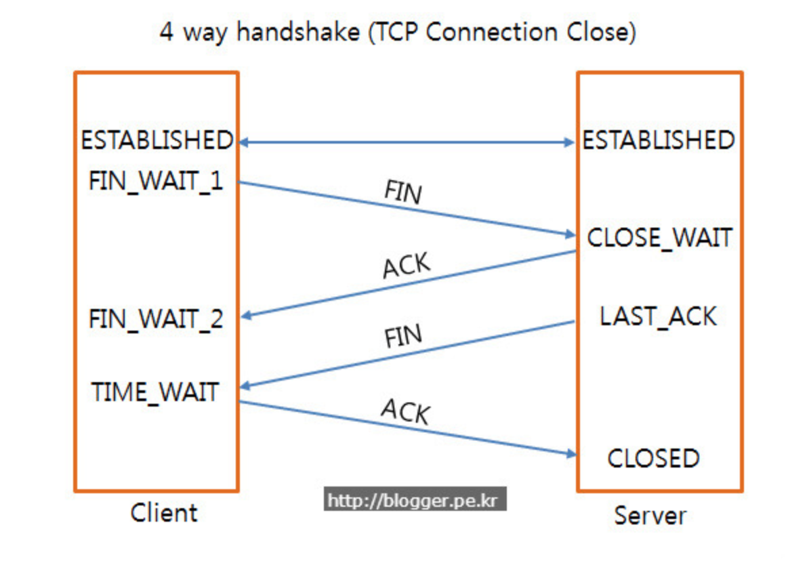

# [Network](https://github.com/hyojaekim/TIL/tree/master/Network) / [🏠 Home](https://github.com/hyojaekim/TIL)

### 3way handshake & 4way handshake

TCP의 정확한 전송을 위해 연결을 성립, 해제 하는 과정을 3way handshake & 4way handshake라고 한다.

### 3way handshake (연결 성립)

.png)

1. 서버에게 접속을 요청하는 SYN(M) 패킷을 보낸다. 이때 (M)은 시퀀스 넘버를 뜻하며 랜덤 숫자를 의미한다.

2. 서버는 클라이언트가 보낸 SYN(M)을 받고, 요청을 수락한다는 ACK(M + 1)과 SYN(N)을 보내게 된다. (M + 1)은 클라이언트에서 보낸 스퀀스 넘버에 +1을 한다는 의미이고, (N)은 새로운 랜덤 숫자를 의미한다.

3. 클라이언트는 ACK(M + 1)와 SYN(N) 패킷을 받고, ACK(N + 1)를 서버로 보내면 연결이 성립된다.

### 4way handshake (연결 해제)

.png)

1. 클라이언트가 서버로 연결을 종료하겠다는 FIN 플래그를 보낸다.

2. 서버는 FIN 플래그를 받고, 알겠다는 ACK를 보낸다.

    * 서버에서 데이터를 모두 전송할 때까지 TIME-OUT이 된다.

4. 데이터를 모두 보내고, 서버가 클라이언트에게 FIN 플래그를 보낸다.

5. 클라이언트는 FIN 플래그를 받고, ACK를 보낸다.

    * 서버는 ACK를 받고, 소켓 연결을 Close 한다.

    * 클라이언트는 서버로부터 받지 못한 데이터가 있을 수 있으므로, 일정 시간 세션을 남겨두고, 잉여 패킷을 기다린다.(TIME-WAIT)

### Packet

TCP 헤더에는 Flag Bit(Code Bit)가 존재한다. 6Bit로 이루어져 있다.(000000) 해당 비트는 Urg,Ack,Psh,Rst,Syn,Fin 순서로 이루어져 있다.

### Sequence number가 난수인 이유?

커넥션을 맺을때 포트는 재사용된다. 서버는 패킷의 SYN을 보고 구분하는데 난수가 아니라면, 이전 커넥션으로 오는 패킷으로 인식할 수 있다. 따라서 이러한 문제를 해결하기 위해 난수로 설정한다.

### [맨 위로 이동](https://github.com/hyojaekim/TIL/blob/master/Network/handshake.md#Network---home)
