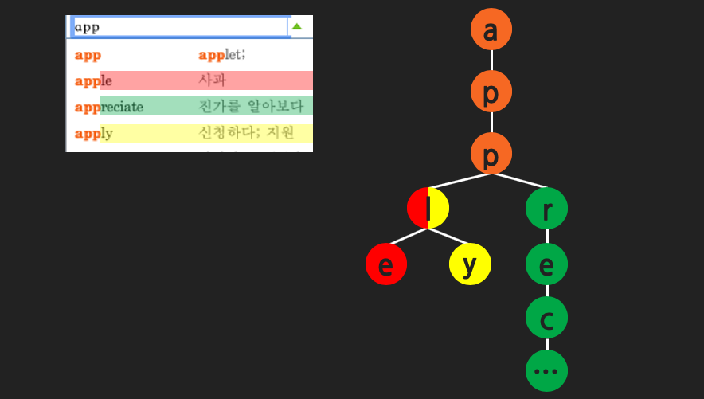

# [DataStructure](https://github.com/hyojaekim/TIL/tree/master/DataStructure) / [🏠 Home](https://github.com/hyojaekim/TIL)

## 트라이(Trie)란?

많은 문자열 중에 특정 문자가 포함되어 있는지 검색하고 싶으면, 하나씩 비교하면서 알아내는 방법이 있다. 하지만 이러한 방법은 매우 비효율적이다. 트라이 자료구조를 사용하면 매우 빠른 속도로 문자열을 검색할 수 있다.

문자열의 최대 길이가 M이라고 하면, O(M)의 시간복잡도를 가진다. 따라서 네이버의 자동 완성 기능과 같이 문자열을 저장, 탐색하는데 유용한 자료구조이다.

> Retrieval 에서 유래되어 프레드킨이 "Trie" 라고 이름을 붙였다.
발음은 트라이, 트리 두 개다 쓰이는데 "Tree" 와 똑같은 발음을 가지고 있어 구분하기 위해 "트라이" 라고 불리고 있다.

### 트라이(Trie)의 구조
사전에서 "apple" 을 찾아보려면 아래와 같은 순서로 찾을 수 있다.

1. 맨 앞글자 'a' 로 시작하는 부분을 찾는다. (a)
2. 다음 'p' 로 시작하는 부분을 찾는다. (ap)
3. 다음 'p' 로 시작하는 부분을 찾는다. (app)
4. 다음 'l' 로 시작하는 부분을 찾는다. (appl)
5. 다음 'e' 로 시작하는 부분을 찾는다. (apple)

기본적으로 K(문자열의 개수)진 트리 구조를 가지며, 위와 같이 논리적으로 컴퓨터에 적용한 것이 트라이 자료구조이다.

위 그림을 보면 app을 검색했을 때 3개의 문자열(apple, appreciate, apply)이 나오게 되는데 문자열을 저장하는 트라이 자료구조를 보면 위와 같다.

### [맨 위로 이동](https://github.com/hyojaekim/TIL/blob/master/DataStructure/trie.md#DataStructure---home)
